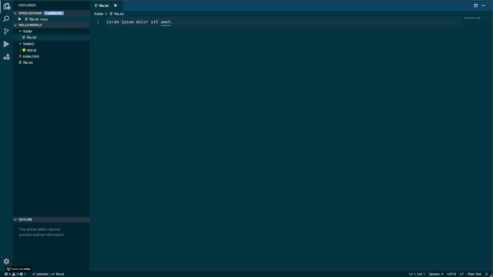

# VSClone

A static template of popular Visual Studio Code editor.



---

## Setup

1. Clone or download repository
   
    ```bash
    git clone https://github.com/ilya-zhidkov/vsclone.git
    ```

2. Open `index.html` file using either local or file server.

---

### Supported Features

- [x] Light Theme
- [x] Dark Theme
- [x] Changing color scheme
- [x] Persisting current color settings
- [x] Switching between sections (For now, only Explorer and Extensions)

---

#### Use case

- Setting up a new **vanilla HTML & CSS** project
- Emphasizing on **HTML 5 semantic tags**
- Positioning elements using **Flexbox** and **CSS Grid**
- Including **FontAwesome 5** icon library
- Improving typography with **Google Fonts** 
- Implementing **Sticky Footer**
- Creating flexible work-flow for adding new **color themes** 
- Persisting current theme in a **locale storage**

---

*Made for students of UJEP (Univerzita Jana Evangelisty Purkyně) in Ústí nad Labem who are specializing in computer science degree.*
